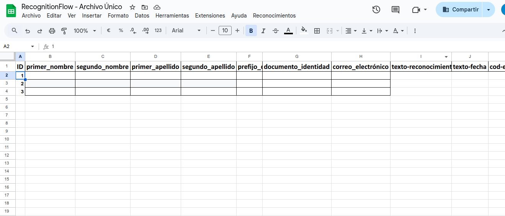
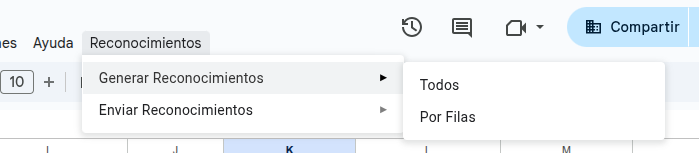
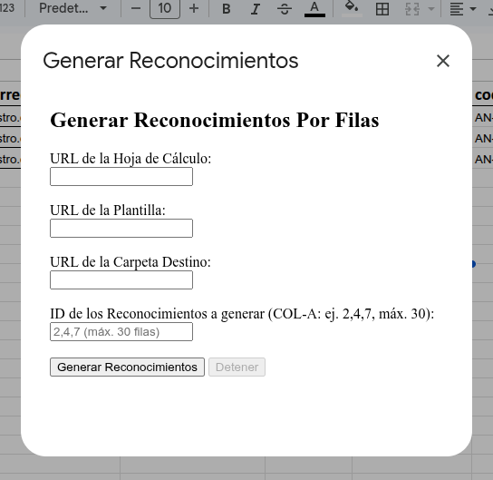
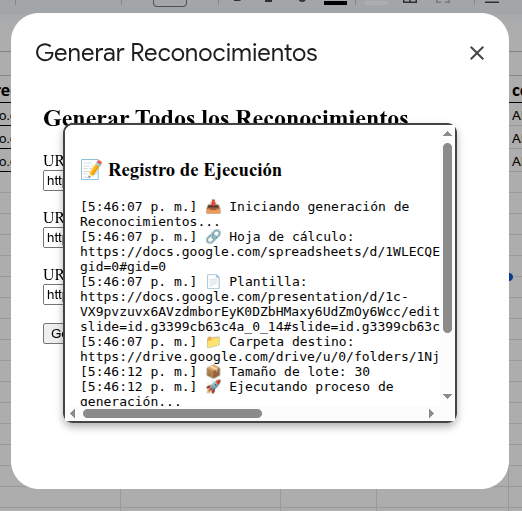
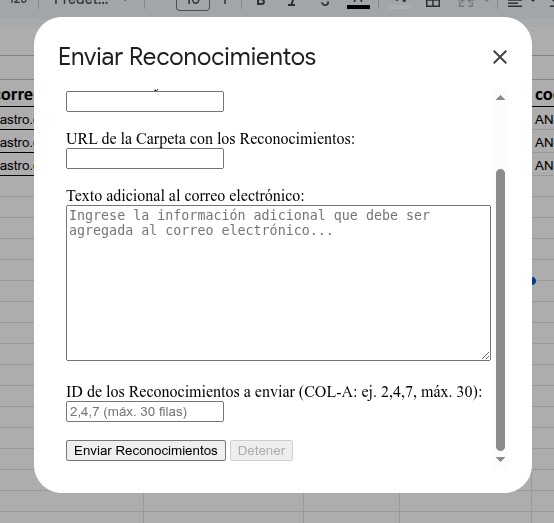
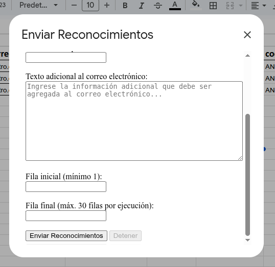

# RecognitionFlow 🏅📜


**RecognitionFlow** es una librería de Google Apps Script para la generación y envío masivo de **reconocimientos digitales** en formato PDF, a partir de una base de datos en Google Sheets y una plantilla de Google Slides.

Esta herramienta, basada en [CertiFlow](https://github.com/blythe91/certiflow), permite automatizar la entrega de diplomas de agradecimiento o Reconocimientos de participación, simplificando todo el proceso con opciones flexibles y una interfaz gráfica amigable.


---

## Características principales ✨

- Generación masiva de **reconocimientos** en lotes (por defecto 30 por ejecución).
- Generación basada en filas específicas, separadas por comas sin espacios.
- Envío masivo de reconocimientos por correo electrónico en lotes.
- Envío por filas específicas o por rangos definidos (mínimo 5, máximo 30 filas).
- Evita duplicados: no genera reconocimientos que ya existan en la carpeta destino.
- Muestra resumen de progreso y estado de ejecución.
- Interfaz integrada en Google Sheets mediante un menú personalizado.

---

## Requisitos 📝

- Tener un Google Spreadsheet con los siguientes **encabezados exactos**:

  ```
  ID  
  primer_nombre  
  segundo_nombre  
  primer_apellido  
  segundo_apellido  
  prefijo_documento_identidad  
  documento_identidad  
  correo_electrónico  
  texto-reconocimiento  
  texto-fecha  
  cod-evento  
  cod-certificado  
  URL_Reconocimiento
  TIPO
  ```

- La plantilla de Google Slides debe contener los siguientes **marcadores**:

  ```
  {{nombre-participante}}  
  {{di-participante}}  
  {{texto-reconocimiento}}  
  {{texto-fecha}}  
  {{cod-certificado}}
  ```

> Los marcadores deben estar escritos tal cual, incluyendo las llaves dobles `{{ }}`.\
> Puedes incluir una segunda diapositiva como contraportada si deseas agregar contenido adicional como temarios o mensajes.

<!-- > 📁 *Ejemplo de plantilla en la carpeta **`docs/`* -->

### Vista de la plantilla

### Plantilla de Google Slides


### Formato de Google Spreadsheets


  - La primera ejecución requiere autorización de permisos de Google Apps Script para acceso a Gmail, Drive y Sheets.  
  - Puede agregarse una página adicional como contraportada para contenido extra en el certificado (como temario o contenido programático).  
  - Los datos de correos y códigos deben estar correctamente ingresados; la librería no verifica duplicados de registros.

---

## Instalación ⚙️

1. Clona o descarga el repositorio en tu máquina local.
2. Instala [clasp](https://github.com/google/clasp) y configura sus pre-requisitos (Node.js, npm).
3. Ejecuta `clasp login` para conectar con tu cuenta Google.
4. Crea un nuevo proyecto clasp con `clasp create --title "RecognitionFlow - Archivo Único" --type sheets`; lo que creará el .clasp.json indicando que el archivo es de tipo hoja de cálculo (sheets) y cuyo nombre sería "RecognitionFlow - Archivo Único"; puede tener cualquier nombre.
4. Usa `clasp push` para subir el proyecto a tu entorno de Google Apps Script.
5. Abre el Google Spreadsheet con tu base de datos: verás un nuevo menú **Reconocimientos**.
6. renombrar la hoja de cálculo de "Hoja 1" a "data", indispensable para el funcionamiento de la librería.

> *Nota:* Planeo publicar esta librería oficialmente para ser importada directamente.

---

## Uso 🚀

Cuando abras tu hoja de cálculo, verás un nuevo menú:

```none
Reconocimientos
├️ Generar reconocimientos
│   ├️ Todos
│   └️ Por filas
└️ Enviar reconocimientos
    ├️ Todos
    ├️ Por filas
    └️ Por rango de filas
```

### Menú principal en la opción "Reconocimientos"


### Submenú de "Generar Reconocimientos"



### Submenú de "Enviar Reconocimientos"


Cada opción abre una interfaz gráfica sencilla para que puedas ingresar los datos necesarios (URL de spreadsheet, plantilla, carpeta Drive, filas o rangos, mensaje personalizado) y ejecutar la acción deseada.

## Interfaz Gráfica de las opciones de menú

### Generar Reconocimientos


### Generar Reconocimientos Por Filas


### Vista de Ejecución


### Enviar todos los Reconocimientos


### Generar Reconocimientos por filas


### Enviar Reconocimientos por rango de filas



---

## Configuración avanzada 🛠️

Puedes cambiar el número de elementos procesados por ejecución (lote) desde:

```javascript
// src/utils/utils.gs
const DEFAULT_BATCH_SIZE = 30;
```

Además, puedes usar tanto IDs como URLs completas para:

- Hoja de cálculo
- Plantilla de Slides
- Carpeta de Drive

La librería extrae automáticamente el ID de la URL.

---

## Estructura del proyecto 📂

```none
src/
├── libs/
│   ├── recgen_all.gs              # Genera todos los reconocimientos
│   ├── recgen_rows.gs             # Genera reconocimientos por filas
│   ├── recog_sender_all.gs        # Envía todos los reconocimientos
│   ├── recog_sender_range.gs      # Envía reconocimientos por rango de filas
│   ├── recog_sender_rows.gs       # Envía reconocimientos por filas específicas
├── utils/
│   └── utils.gs                   # Funciones utilitarias generales
├── main.gs                        # Lógica principal del proyecto
├── menu.gs                        # Configuración del menú en Sheets
├── test/
│   └── test.gs                    # Pruebas
├── modal_cert_all.html           # UI para generar todos los reconocimientos
├── modal_cert_rows.html          # UI para generar por filas
├── modal_send_all.html           # UI para enviar todos
├── modal_send_rows.html          # UI para enviar por filas
├── modal_send_range.html         # UI para enviar por rango
└── README.md
```

---

## Licencias 📜

Este proyecto se distribuye bajo una política de **doble licencia**:

- 🗭 **MIT License**: Uso libre con restricciones mínimas.
- 🔳 **GNU GPLv3**: Si redistribuyes el código, debe ser bajo esta misma licencia y con código fuente disponible.

### 📌 ¿Qué significa esto?

Puedes elegir bajo cuál de estas dos licencias usar el proyecto:

- Si quieres integrar este código en un proyecto cerrado, usa la **MIT**.
- Si deseas que tu versión derivada siga siendo software libre, usa la **GPLv3**.

---

## Autor ✍️

**Oscar Giovanni Castro Contreras**\
Ingeniero en Informática

📧 [oscargiovanni.castro@gmail.com](mailto\:oscargiovanni.castro@gmail.com)\
📱 +58 414 703 9597\
🔗 [LinkedIn](https://www.linkedin.com/in/oscargiovannicastrocontreras/)\
🐙 [GitHub](https://github.com/blythe91)

